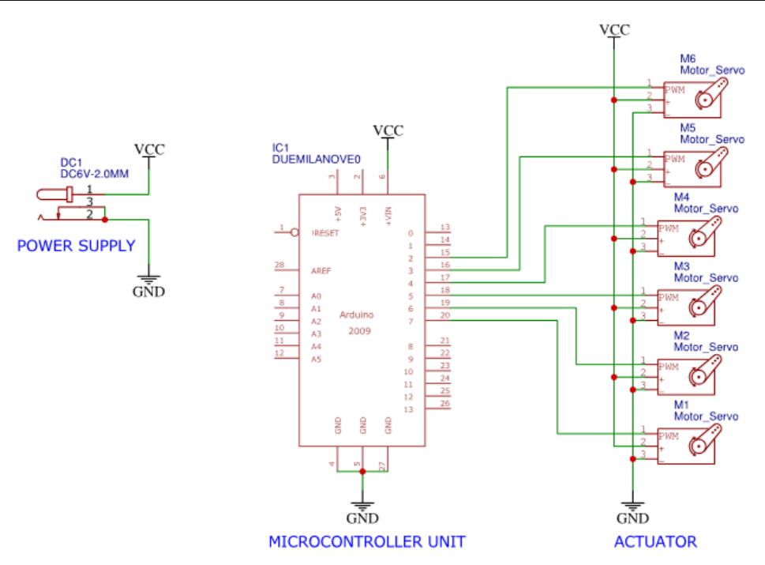

# 📡 Tri-operational Robotic Arm (ECG-Controlled)
A tri-operational robotic arm controlled by ECG signals to perform grasping, rotating, and lifting actions, designed for assistive and biomedical applications.
## 📋 Overview
This project is a **3-Degree of Freedom (3-DOF) robotic arm** capable of performing three primary operations:  
- **Grasping**  
- **Rotating**  
- **Lifting**

The arm is controlled using real-time signals and designed for assistive and biomedical applications, enabling hands-free operation via ECG signal analysis.

---
## 📌 Features

- Operates using **ECG signals** to provide hands-free control of robotic functions.
- Supports **3 primary actions**: **grasping**, **rotating**, and **lifting**.
- Integrates with **ESP32/Arduino** for real-time signal processing and actuation.
- Utilizes **signal thresholds** to trigger specific motor movements based on heart rhythm patterns.
- Built with **modular software** for easy tuning, upgrading, and debugging.
- Designed for **assistive and biomedical applications** such as prosthetics or rehabilitation.
- Fully **wireless operation** possible using ESP32’s built-in Wi-Fi capability.
- Expandable to include **additional biosignals** like EMG or voice commands in the future.
## 🧰 Hardware Components

| **Component**                | **Description**                                         |
|-----------------------------|---------------------------------------------------------|
| ESP32 or Arduino Uno        | Microcontroller for signal processing and motor control |
| ECG Sensor Module (AD8232)  | To detect and process ECG signals from the user         |
| SG90 Servo Motor ×2         | Lightweight servo motors for grasping and lifting       |
| MG995 Servo Motor ×1        | High-torque motor for base rotation                     |
| Breadboard (840-point)      | For prototyping and component connections               |
| Jumper Wires                | Male-to-male and male-to-female connections             |
| 5V Power Supply/Battery     | External power source for motors                        |
| Resistors & Capacitors      | For filtering ECG signal noise                          |
| USB Cable                   | To connect microcontroller to PC for programming        |
## 🔌 Circuit Diagram
Below is the circuit diagram of the tri-operational robotic arm using ECG signal processing.

## 🚀 Applications

- 🏥 **Healthcare & Assistive Technology**  
  Assists physically disabled or paralyzed individuals by enabling hands-free control of essential tasks.

- 🧪 **Biomedical Engineering**  
  Demonstrates integration of physiological signals (ECG) with robotics for medical-grade research and development.

- 🏭 **Automation & Manufacturing**  
  Enables remote operation of machinery in hazardous environments or assembly lines.

- 🤖 **Human-Robot Interaction (HRI)**  
  Enhances natural and intuitive interfaces between humans and robots using biosignals.

- 🎓 **Education & Research**  
  A valuable tool for exploring bio-signal processing, robotics, control systems, and embedded systems.

- 🧤 **Prosthetics & Rehabilitation Devices**  
  Potential base model for developing advanced prosthetic limbs with heart-signal-based control.
